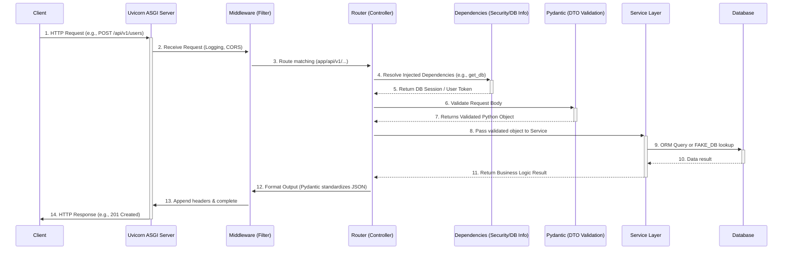

# FastAPI Microservice Architecture

This microservice is built using Python's **FastAPI** framework and structured to match industry standards, highly resembling enterprise patterns found in frameworks like Spring Boot (Java) or NestJS (Node).

## Request Flow Architecture

Below is a sequence diagram detailing exactly what happens from the moment a client sends an HTTP request until they receive a response. 

## How It Compares to Spring Boot

If you are coming from Java / Spring Boot, the concepts map almost 1:1:

1. **Uvicorn**: This is your Embedded Tomcat server. It listens to the port and translates raw TCP/HTTP into something FastAPI understands (ASGI).
2. **Middleware**: Maps perfectly to Spring **Filters** or **Interceptors**. If you need to log every request duration across the whole app or handle CORS, you do it here before it ever hits your business code.
3. **Routers (`app/api/...`)**: These are your Spring **`@RestController`** classes. They should be "dumb". They only care about receiving the web request, ensuring the input exists, and immediately passing it to a Service.
4. **Pydantic Schemas (`app/schemas/...`)**: These act as your **DTOs (Data Transfer Objects)** combined with `@Valid` annotations. Pydantic ensures the raw JSON is exactly what you expect (e.g., ensuring an email looks like an email). 
5. **Dependencies (`app/api/dependencies.py`)**: FastAPI has a native "Dependency Injection" system that evaluates *before* the endpoint runs. It is heavily used for security (like intercepting JWT tokens) or providing database connections (like injecting a `@PersistenceContext`).
6. **Services (`app/services/...`)**: Maps perfectly to Spring **`@Service`** classes. *All* of your heavy lifting, algorithms, and business logic goes here. The API router just calls `UserService.create(...)`.
7. **Models/DB (`app/models/...`)**: Maps to Spring **`@Entity`** objects. This layer handles talking to the database (likely using SQLAlchemy, which is Python's equivalent to Hibernate/JPA).
